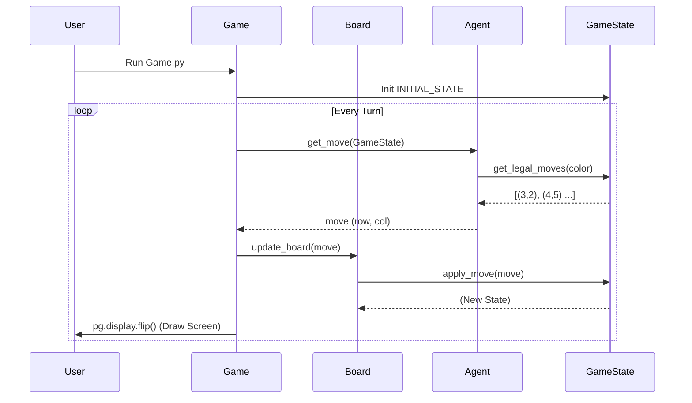
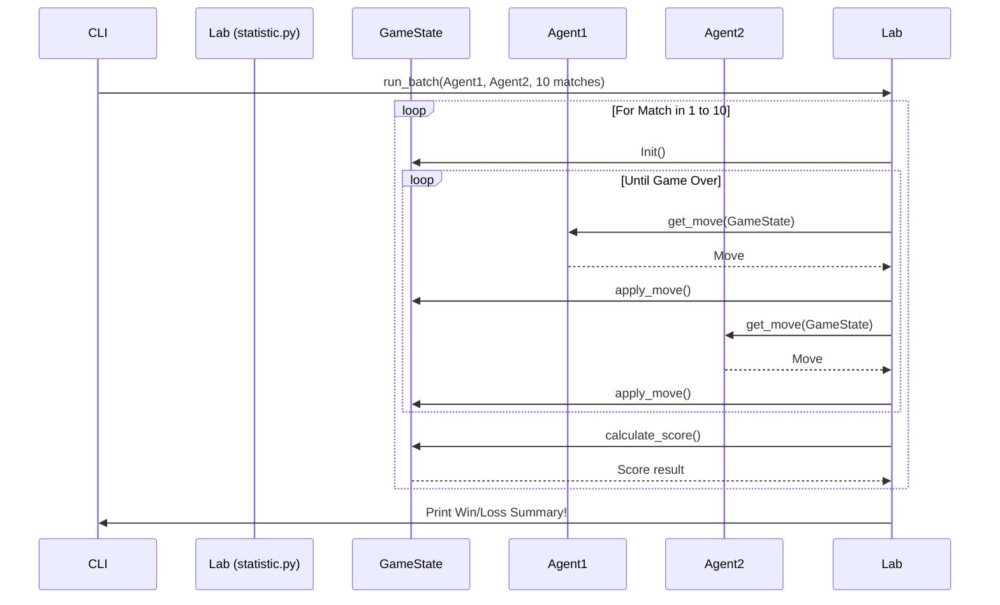

# End-to-End Codebase Explanation: Othello Framework

## 1. Objective
Welcome to the Othello Framework! This document provides a comprehensive, pedagogical, and structural explanation of the entire codebase. Whether you are building a simple rule-based agent or an advanced Minimax/Alpha-Beta Pruning AI, understanding the "What", "How", and "Why" of this framework is your first step to victory.

---

## 2. Phase 1: Structural Mapping (The "What")

Here is the blueprint of our framework. It is divided into distinct files, each handling a specific domain of the game.

### `core.py` (The Game Physics)
| Class Name | Functions/Methods | Input -> Output | Short Purpose |
| :--- | :--- | :--- | :--- |
| `GameState` | `__init__` | `board, turn` -> `None` | Initializes the board state and current turn. |
| | `get_board_copy` | `None` -> `GameState` | Returns a deep copy of the current state to prevent reference bugs. |
| | `calculate_score` | `None` -> `(int, int)` | Counts and returns the pieces for Black and White. |
| | `get_legal_moves` | `color` -> `list[(row, col)]` | Scans the board and returns all valid "sandwich" moves. |
| | `_is_valid_action`| `row, col, player` -> `bool` | Checks if placing a piece at (row, col) flips opponent pieces. |
| | `apply_move` | `move, color` -> `GameState` | Creates a new state, places the piece, and flips opponent pieces. |
| | `is_game_over` | `None` -> `bool` | Returns True if neither player has any legal moves left. |

### `Agents.py` (The Actors)
| Class Name | Functions/Methods | Input -> Output | Short Purpose |
| :--- | :--- | :--- | :--- |
| `BaseAgent` | `__init__` | `color, name` -> `None` | Sets the agent's color (1 for Black, -1 for White). |
| | `get_move` | `game_state` -> `(move, metrics)` | Abstract method. All custom agents must implement this. |
| `RandomAgent`| `__init__` | `color, name` -> `None` | Inherits from BaseAgent. |
| | `get_move` | `game_state` -> `(move, metrics)` | Randomly picks a move from the list of legal moves. |

### `Game.py` (The Stage/UI)
| Class Name | Functions/Methods | Input -> Output | Short Purpose |
| :--- | :--- | :--- | :--- |
| (None) | `main` | `None` -> `None` | The entry point. Initializes agents, board, and starts the loop. |
| `Board` | `__init__` | `game_state` -> `None` | Bridges the logical `GameState` with the Pygame UI. |
| | `draw_board` | `surface` -> `None` | Renders the green grid, black, and white circles. |
| | `update_board` | `position, player` -> `bool` | Validates and applies a move, updating the internal state. |
| `Player` | `__init__`, `move`| `agent, turn` -> `move` | Wraps an Agent; manages its time limit and execution. |
| `Game` | `loop` | `None` -> `None` | The main UI event loop checking turns, time, and drawing the UI. |

### `statistic.py` (The Lab)
| Class Name | Functions/Methods | Input -> Output | Short Purpose |
| :--- | :--- | :--- | :--- |
| (None) | `simulate_game` | `agent1, agent2` -> `int` | Runs a single headless game as fast as possible. |
| (None) | `run_batch` | `cls1, cls2, int` -> `None` | Pits two agent classes against each other for N matches. |

### `DQN/Minimax.py` (The Legacy Brain / Reference)
| Class/File | Functions/Methods | Input -> Output | Short Purpose |
| :--- | :--- | :--- | :--- |
| Minimax | `heuristic` | `board, player` -> `float` | Evaluates board favorability using a predefined 8x8 weight matrix. |
| | `first_maximize` | `board, player...` -> `move` | The root call for the Minimax search algorithm. |

---

## 3. Phase 2: The Reading Roadmap (The "Order")

To fully grasp the AI infrastructure, do **not** read alphabetically. Read logically:

1. **First: `core.py` (The "Physics").** Understand how the matrix is structured (`1`, `-1`, `0`) and how a move updates this matrix. If you don't know the rules, you can't build the AI.
2. **Second: `Agents.py` (The "Actors").** Look at `RandomAgent` to see how an agent interacts with `core.py` to find and return a move.
3. **Third: `Game.py` (The "Stage").** See how Pygame requests moves from the actors and draws the physics onto the screen.
4. **Fourth: `DQN/Minimax.py` (The "Brain").** Study this file to see how a Search Algorithm is structured. Notice how it looks ahead by simulating moves. (You will implement a cleaner version of this using the new `GameState`).
5. **Last: `statistic.py` (The "Lab").** Learn how to evaluate your AI's Win Rate objectively without waiting an hour for UI animations.


## 4. Phase 3: Deep Dive (Line-by-Line Breakdown)

### Deep Dive 1: The Move Logic (`core.py`)
```python
def get_legal_moves(self, color):
    valid_actions = []
    for i in range(8):           # Iterate over all 8 rows
        for j in range(8):       # Iterate over all 8 columns
            if self._is_valid_action(i, j, color):  # Check if playing at (i,j) flips pieces
                valid_actions.append((i, j))        # If yes, add to the list of legal moves
    return valid_actions
```
**Why it matters:** Your AI will call this at every node of the Minimax tree to know its branching factor.

### Deep Dive 2: State Cloning & Simulation (core.py)
```python
def apply_move(self, move, color):
    new_state = self.get_board_copy()   # 1. CRITICAL: Copy the board. Do NOT modify the real one.
    new_state.current_turn = -color     # 2. Swap the turn for the next state.
    
    if move is None:                    # 3. Handle 'Pass' moves when no legal moves exist.
        return new_state
        
    row, col = move[0], move[1]
    new_state.board[row][col] = color   # 4. Place the piece.
    
    # ... (Logic to iterate 8 directions and flip opponent pieces) ...

    return new_state                    # 5. Return the futuristic hypothetical board.
```
**Why it matters:** AI Search algorithms dream of the future. They need to imagine thousands of board states without overwriting the actual GUI board. `apply_move` makes this dream possible by deep-copying.

### Deep Dive 3: The Agent Interface (Agents.py)
```python
def get_move(self, game_state):
    start_time = time.perf_counter()                     # Start a fast timer
    valid_moves = game_state.get_legal_moves(self.color) # Ask core.py for options
    
    move = rd.choice(valid_moves) if valid_moves else None # Pick a random move
        
    move_time = time.perf_counter() - start_time         # Stop timer
    metrics = {"move_time": move_time, "nodes_explored": 1} # Format statistics
    return move, metrics                                 # Return instruction to Game
```
**Why it matters:** A standard interface means Game.py doesn't care if an agent is Random, human, or the most advanced Minimax AI. It just asks for `get_move()` and expects coordinates back.

---

## 5. Phase 4: Execution Flows (The "How it Runs")

How does data travel through this system? There are two main ways the program is used.

### Flow A: The GUI Mode (Running `python Game.py`)
This flow focuses on player experience, rendering 60 FPS, checking time limits, and animating turns.



### Flow B: The Headless Benchmarking (Running `python statistic.py`)
This flow bypasses Pygame entirely. It's designed to simulate thousands of games per minute. This is how you verify the "10/10 win rate against Random" constraint required by the Assignment.



---
*Happy Coding! Building a Search Agent is like teaching a computer to foresee the future. Use the `GameState` extensively, evaluate smartly, and remember: prune your branches!*
